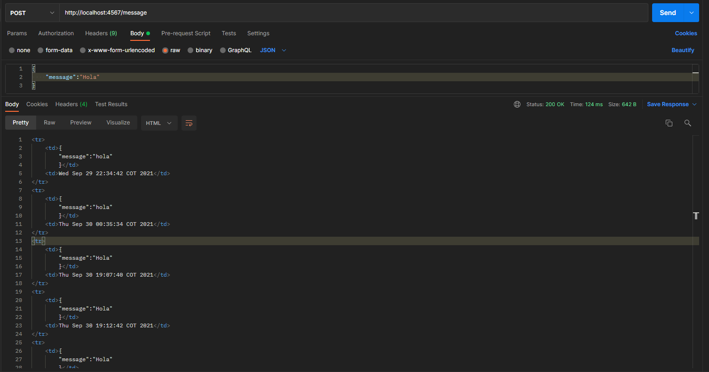
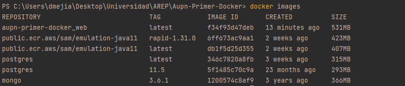
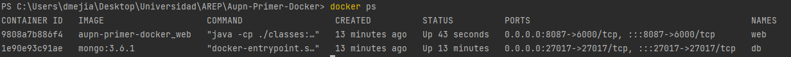
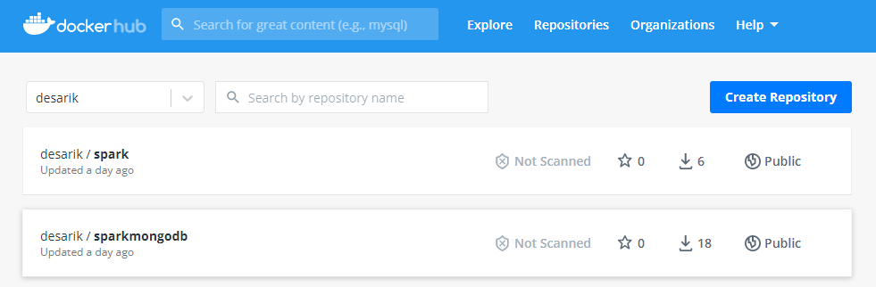
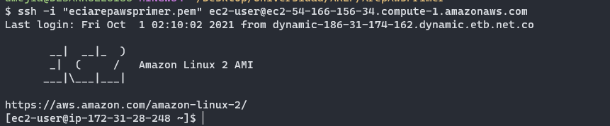

# TALLER DE DE MODULARIZACIÓN CON VIRTUALIZACIÓN E INTRODUCCIÓN A DOCKER Y A AWS

En este taller encontrará una aplicación web pequeña usando el framework Spark java (http://sparkjava.com/). 
Ademas se van a construir varios contenedores docker para las aplicaciónes y base datos que posteriormente
se desplegaremos en una instancia EC2. 

## Prerrequisitos

- git version 2.25.1
- Apache Maven version: 4.0.0
- java version "1.8.0"
- Docker version 4.0.1
### Ejecucion

Para poder usar el proyecto lo primero que se debe realizar es clonar el proyecto utilizando el siguiente comando desde una terminal:

```
git clone https://github.com/Desarik98/Arep-Primer-Docker.git
```

Luego debe redirigirse por medio de la terminal al directorio en donde se clonó el proyecto la cual contendrá el archivo pom.xml. Una vez ubicado en este directorio se debe compilar el programa, para esto, utilice el siguiente comando:

```
mvn package
```

## Diseño

La aplicación inicial llamada RoundRobin va a recibir las los logs por parte del usuario, esta estará montada en una
instancia de EC2 que posteriormente será conectada a un LoadBalancer el cual conectara 3 imagenes docker corriendo por distintos 
puertos y guardara los logs en la base de datos MongoDB.


## Construccion

### MongoDB

Se utilizó una imagén de mongo que esta publicada en un repositorio de Docker Hub para que posteriormente se añadiera
al docker-compose.yml:

```
version: '2'


services:
web:
build:
context: .
dockerfile: Dockerfile
container_name: web
ports:
- "8087:6000"
db:
image: mongo:3.6.1
container_name: db
volumes:
- mongodb:/data/db
- mongodb_config:/data/configdb
ports:
- 27017:27017
command: mongod

volumes:
mongodb:
mongodb_config:
```

Como se puede observar se agregó como servicio con el nombre db utilizando la imagen mongo:3.6.1

### LogService

Servicio en el cual se podrán registrar en la base de datos descrita anteriormente diferentes mensajes puestos por el usuario.

El servicio de logs se realizo mediante el framework Spark en donde se añadieron dos endpoints, uno
correspondiente al metodo POST para poder insertar los mensajes de manera correcta en la base de datos, y otro
con el metodo GET para poder obtener los 10 ultimos logs.



### Creación de contenedores 

Para que la imagen de docker pueda ejecutar la aplicación java se deberá crear el siguiente DockerFile:

```
FROM openjdk:8

WORKDIR /usrapp/bin

ENV PORT 6000

COPY /target/classes /usrapp/bin/classes
COPY /target/dependency /usrapp/bin/dependency

CMD ["java","-cp","./classes:./dependency/*","edu.escuelaing.arep.SparkWebServer"]
```

El cual al ejecutarse ejecutara la instruccion para poder compilar el proyecto. A continuación se debera ejecutar los siguientes 
comandos en el directorio raiz de nuestro proyecto para generar las dependencias y estas puedan ser añadidas a la imagen:

```
mvn clean
mvn install
```

Ahora se crearan dos contenedores docker, el primero conteniendo la base de datos como se pudo ver anteriormente,y el segundo para
dockerizar la aplicacion java. Para crear los contenedores, en una terminal se deberá ejecutar el siguiente comando:

```
docker-compose up -d
```

Para ver que efectivamente los contenedores se hallan ejecutado y creado utilizaremos el comando:

```
docker images
docker ps
```





### Subir imagenes a DockerHub

Para subir una imagen a DockerHub se debera tener una cuenta creada en el mismo, y crear 2 repositorios,
uno para la base de datos MongoDB y otro para la aplicación Java, posteriormente utilizaremos el siguiente comando
para asociar cada una de las imágenes a un repositorio en DockerHub.



Primero deberemos iniciar sesión en docker mediante el comando

```
docker login
```

Pondremos nuestras credenciales, y ahora asociaremos las imagenes a los repositorios creados mediante el comando:

```
docker tag mongo:3.6.1 desarik/sparkmongodb
docker tag aupn-primer-docker-web desarik/spark
```

Y ahora subiremos las imagenes mediante el comando

```
docker push dnielben/sparkmongodb:latest
docker push dnielben/spark:latest
```

### Descargar los contenedores en EC2

Para descargar los contenedores y instalarlos en una maquina EC2, primero deberemos crear una instancia
EC2, crear un certificado y iniciar sesion mediante el protocolo ssh en una terminal, si su sistema operativo
es Windows se recomienda el uso de una terminal Linux descargada, para este caso se utilizara el mismo GitBash.



Procederemos a actualizar el sistema mediante el comando

```
sudo yum update
```

Y a descargar docker en nuestra instancia de EC2 mediante el comando

```
sudo yum install docker
```

Le daremos permisos de ejecución en el sistema mediante el comando:

```
sudo service start docker
```
y cambiar los permisos de usuario del usuario user-ec2 con el siguiente comando:

```
sudo usermod -a -G docker ec2-user
```

Nos desconectaremos de la instancia de EC2 para que los cambios surtan efecto, y nos volveremos 
a conectar para descargar las imágenes de DockerHub y ejecutarlas mediante el siguiente comando:

Para la imagen que contiene el spark:

```
docker run -d -p 42000:6000 --name sparkaws desarik/spark
```

Para la imagen que contiene el MongoDB

```
docker run -d -p 42000:6000 --name sparkmongodb desarik/sparkmongodb
```

y mediante la direccion podremos acceder al servicio desplegado mediante la pagina
web

```
http://ec2-54-166-156-34.compute-1.amazonaws.com:42000/logService
```

La maquina estara apagada por efectos de costos.

### Autor
- Daniel Alejandro Mejía Rojas - Fecha: 30/10/2021

### Licencia
This project is licensed under the MIT License - see the LICENSE.md file for details
